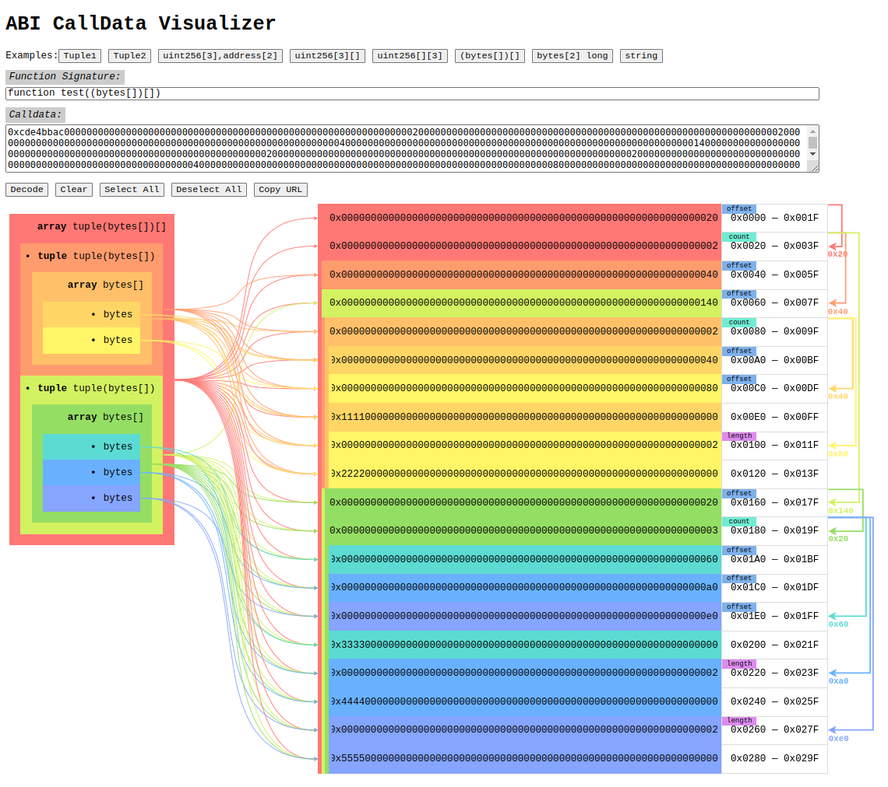

# ABI CallData Visualizer



## What is it?

The **ABI CallData Visualizer** is a web-based tool designed to help developers, auditors, and smart contract engineers decode and visualize calldata used in Ethereum smart contracts. It provides an intuitive graphical representation of complex calldata structures, such as arrays, tuples, and nested data types, making it easier to understand how input data is structured and encoded.

## Key Features

- **Calldata Decoding**: Input raw calldata and see it decoded into human-readable parameters.
- **Graphical Visualization**: Visual representation of calldata elements, showing offsets, lengths, and data flow.
- **Supports Nested Structures**: Handles arrays, tuples, and other complex Solidity types.
- **Function Signature Input**: Enter ABI function signatures for automatic calldata decoding.
- **Interactive**: Select, deselect, and manipulate decoded elements for closer inspection.
- **URL Sharing**: Copy a shareable URL with the current calldata and visualization state.

## Who is it for?

This tool is primarily for:

- **Blockchain Developers**: Debugging smart contract inputs and calldata.
- **Auditors**: Verifying calldata structure and contents in contract audits.
- **Web3 Engineers**: Visualizing calldata for smart contract interactions.

## How to Use

1. **Enter Function Signature**: Type or paste the Solidity function signature, e.g., `function test(string)`.
2. **Enter Calldata**: Paste the hexadecimal calldata string in the provided field.
3. **Decode**: Click the `Decode` button to view the visual representation of the calldata.
4. **Inspect**: View offsets, counts, and other data related to the calldata structure.
5. **Share**: Use the `Copy URL` button to share the visualization with others.

## How to Run Locally

To run the project locally, follow these steps:

```bash
git clone git@github.com:PurrProof/calldata-visualizer.git
cd calldata-visualizer
pnpm i
pnpm start
```

This project uses `pnpm` as the package manager for faster and more efficient dependency management. If you prefer using another package manager, simply replace `pnpm` with `npm`, `yarn`, or any other package manager you prefer in the commands above.

## Credits

This project is built using several open-source tools and libraries. I would like to give credit to the authors and maintainers of the following:

- [Ethers.js](https://github.com/ethers-io/ethers.js) – Used for ABI decoding and interacting with Ethereum data (a customized version was used).
- [React](https://reactjs.org/) – The UI framework used to build the interactive application.
- [Create-React-app](https://github.com/facebook/create-react-app) – Create React apps with no build configuration.
- [React-xarrows](https://github.com/Eliav2/react-xarrows) – Used to draw arrows between elements in the visual representation of calldata.
- [Zustand](https://github.com/pmndrs/zustand) – A lightweight state management library used to manage the application's state.
- [And Design Colors](https://github.com/ant-design/ant-design-colors) - Color Palettes Calculator of Ant Design
- [Copy-to-clipboard](https://github.com/sudodoki/copy-to-clipboard) – Enables the copy-to-clipboard functionality for sharing calldata and visualizations.
- [Pnpm](https://pnpm.io) – Fast, disk space efficient package manager.
- [Flowbyte][https://github.com/themesberg/flowbite] – Icons

### Other Dependencies

In addition to the main tools listed above, this project also uses various other libraries and tools from the JavaScript/React ecosystem to provide additional functionality.

I extend my thanks to the open-source community for their contributions and support!
